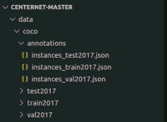
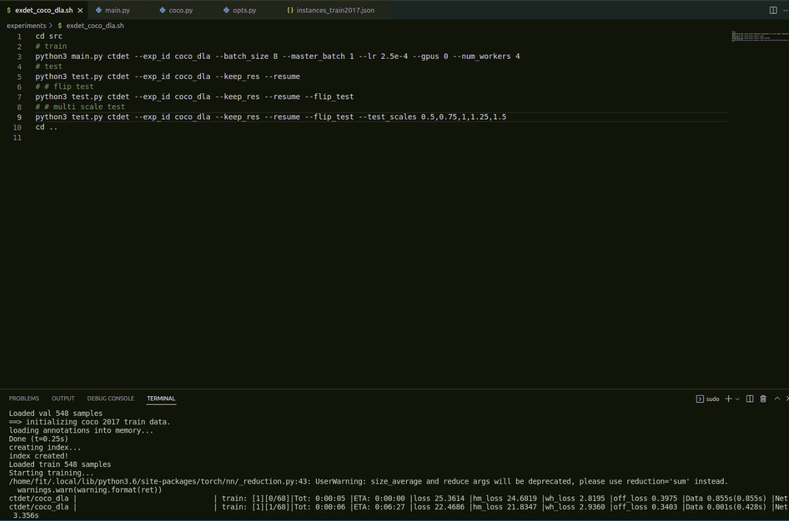
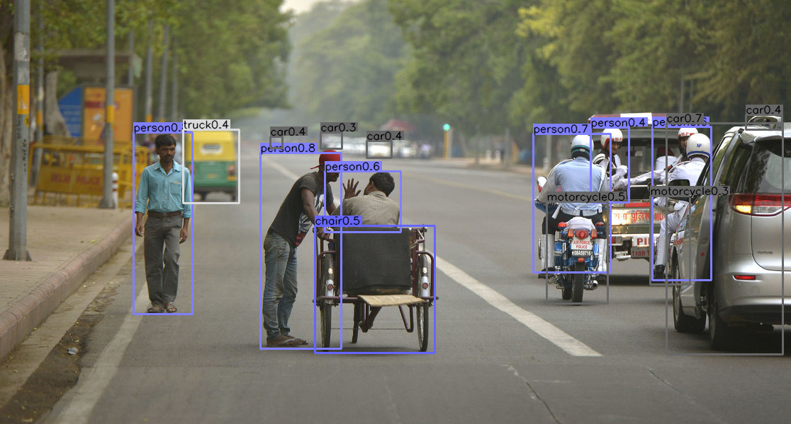
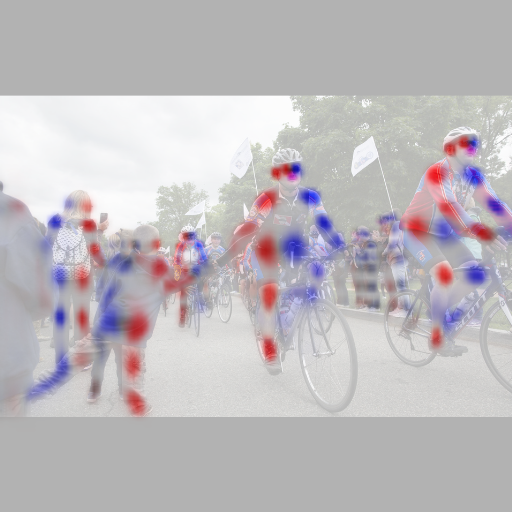

# Cách chạy CenterNet theo custom dataset
## Môi trường
- Cuda 10-1
- torch <= 1.4.0
- phải như vậy thì mới make được các lib trong model
## Dataset custom
- như folder data
- miêu tả: annotations gồm các file txt
- mỗi file txt bao gồm 
```
<bbox_left>,<bbox_top>,<bbox_width>,<bbox_height>,<score>,<object_category>,<truncation>,<occlusion>


    Name                                                  Description
-------------------------------------------------------------------------------------------------------------------------------     
 <bbox_left>	     Tọa độ x của góc trên cùng bên trái của hộp giới hạn được dự đoán

 <bbox_top>	     Tọa độ y của góc trên bên trái của hộp giới hạn đối tượng được dự đoán

 <bbox_width>	     Chiều rộng tính bằng pixel của hộp giới hạn đối tượng được dự đoán

<bbox_height>	     Chiều cao tính bằng pixel của hộp giới hạn đối tượng được dự đoán

   <score>	     Điểm trong tệp DETECTION cho biết độ tin cậy của hộp giới hạn dự đoán bao quanh
                      một thể hiện đối tượng.
                      Điểm trong tệp GROUNDTRUTH được đặt thành 1 hoặc 0. 1 cho biết hộp giới hạn được xem xét trong đánh giá,
                      trong khi 0 cho biết hộp giới hạn sẽ bị bỏ qua.
                      
<object_category>    Danh mục đối tượng cho biết loại đối tượng được chú thích, (tức là vùng bị bỏ qua (0), người đi bộ (1),
                      người (2), xe đạp (3), ô tô (4), xe van (5), xe tải (6), xe ba bánh (7), xe ba bánh có mái hiên (8), xe buýt (9), xe máy (10),
                      những người khác (11))
                      
<truncation>	     Điểm trong tệp kết quả DETECTION phải được đặt thành hằng số -1.
                      Điểm trong tệp GROUNDTRUTH cho biết mức độ của các bộ phận đối tượng xuất hiện bên ngoài khung
                      (nghĩa là không cắt bớt = 0 (tỷ lệ cắt bớt 0%) và cắt bớt một phần = 1 (tỷ lệ cắt bớt 1% ~ 50%)).
                      
<occlusion>	    Điểm trong tệp DETECTION phải được đặt thành hằng số -1.
                      Điểm trong tệp GROUNDTRUTH cho biết phần nhỏ của các đối tượng đang bị che khuất (tức là không bị tắc = 0
                      (tỷ lệ khớp cắn 0%), khớp cắn một phần = 1 (tỷ lệ khớp cắn 1% ~ 50%), và khớp cắn nặng = 2
                      (tỷ lệ tắc 50% ~ 100%)).
                  
```
- tiếp theo đó chạy sửa đường dẫn trong 2 file sau đó chạy
```
python3 src/tools/vis_to_voc_xml.py
python3 src/tools/voc_xml_to_json.py
```
- Như vậy chúng ta đã chỉnh sửa được dữ liệu theo định dạng COCO
- sau đó chúng ta nên đưa dữ liệu về 1 thư mục 
```
data\images\*.png
data\new_annos.json
```
- cấu trúc:


## Make model
- B1: make dla34 network
```
cd ./src/lib/models/networks
rm -rf DCNv2
git clone https://github.com/CharlesShang/DCNv2.git
cd DCNv2
./make.sh
python testcuda.py

-- Nhớ sửa ở file .make.sh : sudo python3 lấy phân quyền
```
- B2: cài COCOAPI
```
# COCOAPI=/path/to/clone/cocoapi
git clone https://github.com/cocodataset/cocoapi.git $COCOAPI
cd $COCOAPI/PythonAPI
make
sudo python3 setup.py install --user
```
- B3: tiếp tục make
```
cd ./src/lib/external
make


- nhớ sửa make file
all:
	sudo python3 setup.py build_ext --inplace
	sudo rm -rf build
```
- B4:  Download pertained models for [detection]() or [pose estimation]() and move them to `$CenterNet_ROOT/models/`. More models can be found in [Model zoo](MODEL_ZOO.md).

## Train 
-
- experement
- sau main.py sửa thành 
```
python3 main.py ctdet  ..............
phía dưới tương tự
```
- hình ảnh:




# Objects as Points
Object detection, 3D detection, and pose estimation using center point detection:

> [**Objects as Points**](http://arxiv.org/abs/1904.07850),            
> Xingyi Zhou, Dequan Wang, Philipp Kr&auml;henb&uuml;hl,        
> *arXiv technical report ([arXiv 1904.07850](http://arxiv.org/abs/1904.07850))*         


Contact: [zhouxy@cs.utexas.edu](mailto:zhouxy@cs.utexas.edu). Any questions or discussions are welcomed! 

## Updates

 - (June, 2020) We released a state-of-the-art Lidar-based 3D detection and tracking framework [CenterPoint](https://github.com/tianweiy/CenterPoint).
 - (April, 2020) We released a state-of-the-art (multi-category-/ pose-/ 3d-) tracking extension [CenterTrack](https://github.com/xingyizhou/CenterTrack).

## Abstract 

Detection identifies objects as axis-aligned boxes in an image. Most successful object detectors enumerate a nearly exhaustive list of potential object locations and classify each. This is wasteful, inefficient, and requires additional post-processing. In this paper, we take a different approach. We model an object as a single point -- the center point of its bounding box. Our detector uses keypoint estimation to find center points and regresses to all other object properties, such as size, 3D location, orientation, and even pose. Our center point based approach, CenterNet, is end-to-end differentiable, simpler, faster, and more accurate than corresponding bounding box based detectors. CenterNet achieves the best speed-accuracy trade-off on the MS COCO dataset, with 28.1% AP at 142 FPS, 37.4% AP at 52 FPS, and 45.1% AP with multi-scale testing at 1.4 FPS. We use the same approach to estimate 3D bounding box in the KITTI benchmark and human pose on the COCO keypoint dataset. Our method performs competitively with sophisticated multi-stage methods and runs in real-time.

## Highlights

- **Simple:** One-sentence method summary: use keypoint detection technic to detect the bounding box center point and regress to all other object properties like bounding box size, 3d information, and pose.

- **Versatile:** The same framework works for object detection, 3d bounding box estimation, and multi-person pose estimation with minor modification.

- **Fast:** The whole process in a single network feedforward. No NMS post processing is needed. Our DLA-34 model runs at *52* FPS with *37.4* COCO AP.

- **Strong**: Our best single model achieves *45.1*AP on COCO test-dev.

- **Easy to use:** We provide user friendly testing API and webcam demos.

## Main results

### Object Detection on COCO validation

| Backbone     |  AP / FPS | Flip AP / FPS|  Multi-scale AP / FPS |
|--------------|-----------|--------------|-----------------------|
|Hourglass-104 | 40.3 / 14 | 42.2 / 7.8   | 45.1 / 1.4            |
|DLA-34        | 37.4 / 52 | 39.2 / 28    | 41.7 / 4              |
|ResNet-101    | 34.6 / 45 | 36.2 / 25    | 39.3 / 4              |
|ResNet-18     | 28.1 / 142| 30.0 / 71    | 33.2 / 12             |

### Keypoint detection on COCO validation

| Backbone     |  AP       |  FPS         |
|--------------|-----------|--------------|
|Hourglass-104 | 64.0      |    6.6       |
|DLA-34        | 58.9      |    23        |

### 3D bounding box detection on KITTI validation

|Backbone|FPS|AP-E|AP-M|AP-H|AOS-E|AOS-M|AOS-H|BEV-E|BEV-M|BEV-H| 
|--------|---|----|----|----|-----|-----|-----|-----|-----|-----|
|DLA-34  |32 |96.9|87.8|79.2|93.9 |84.3 |75.7 |34.0 |30.5 |26.8 |


All models and details are available in our [Model zoo](readme/MODEL_ZOO.md).

## Installation

Please refer to [INSTALL.md](readme/INSTALL.md) for installation instructions.

## Use CenterNet

We support demo for image/ image folder, video, and webcam. 

First, download the models (By default, [ctdet_coco_dla_2x](https://drive.google.com/open?id=1pl_-ael8wERdUREEnaIfqOV_VF2bEVRT) for detection and 
[multi_pose_dla_3x](https://drive.google.com/open?id=1PO1Ax_GDtjiemEmDVD7oPWwqQkUu28PI) for human pose estimation) 
from the [Model zoo](readme/MODEL_ZOO.md) and put them in `CenterNet_ROOT/models/`.

For object detection on images/ video, run:

~~~
python demo.py ctdet --demo /path/to/image/or/folder/or/video --load_model ../models/ctdet_coco_dla_2x.pth
~~~
We provide example images in `CenterNet_ROOT/images/` (from [Detectron](https://github.com/facebookresearch/Detectron/tree/master/demo)). If set up correctly, the output should look like

<p align="center">   </p>

For webcam demo, run     

~~~
python demo.py ctdet --demo webcam --load_model ../models/ctdet_coco_dla_2x.pth
~~~

Similarly, for human pose estimation, run:

~~~
python demo.py multi_pose --demo /path/to/image/or/folder/or/video/or/webcam --load_model ../models/multi_pose_dla_3x.pth
~~~
The result for the example images should look like:

<p align="center">      </p>

You can add `--debug 2` to visualize the heatmap outputs.
You can add `--flip_test` for flip test.

To use this CenterNet in your own project, you can 

~~~
import sys
CENTERNET_PATH = /path/to/CenterNet/src/lib/
sys.path.insert(0, CENTERNET_PATH)

from detectors.detector_factory import detector_factory
from opts import opts

MODEL_PATH = /path/to/model
TASK = 'ctdet' # or 'multi_pose' for human pose estimation
opt = opts().init('{} --load_model {}'.format(TASK, MODEL_PATH).split(' '))
detector = detector_factory[opt.task](opt)

img = image/or/path/to/your/image/
ret = detector.run(img)['results']
~~~
`ret` will be a python dict: `{category_id : [[x1, y1, x2, y2, score], ...], }`

## Benchmark Evaluation and Training

After [installation](readme/INSTALL.md), follow the instructions in [DATA.md](readme/DATA.md) to setup the datasets. Then check [GETTING_STARTED.md](readme/GETTING_STARTED.md) to reproduce the results in the paper.
We provide scripts for all the experiments in the [experiments](experiments) folder.

## Develop

If you are interested in training CenterNet in a new dataset, use CenterNet in a new task, or use a new network architecture for CenterNet, please refer to [DEVELOP.md](readme/DEVELOP.md). Also feel free to send us emails for discussions or suggestions.

## Third-party resources

- CenterNet + embedding learning based tracking: [FairMOT](https://github.com/ifzhang/FairMOT) from [Yifu Zhang](https://github.com/ifzhang).
- Detectron2 based implementation: [CenterNet-better](https://github.com/FateScript/CenterNet-better) from [Feng Wang](https://github.com/FateScript).
- Keras Implementation: [keras-centernet](https://github.com/see--/keras-centernet) from [see--](https://github.com/see--) and [keras-CenterNet](https://github.com/xuannianz/keras-CenterNet) from [xuannianz](https://github.com/xuannianz).
- MXnet implementation: [mxnet-centernet](https://github.com/Guanghan/mxnet-centernet) from [Guanghan Ning](https://github.com/Guanghan).
- Stronger human open estimation models: [centerpose](https://github.com/tensorboy/centerpose) from [tensorboy](https://github.com/tensorboy).
- TensorRT extension with ONNX models: [TensorRT-CenterNet](https://github.com/CaoWGG/TensorRT-CenterNet) from [Wengang Cao](https://github.com/CaoWGG).
- CenterNet + DeepSORT tracking implementation: [centerNet-deep-sort](https://github.com/kimyoon-young/centerNet-deep-sort) from [kimyoon-young](https://github.com/kimyoon-young).
- Blogs on training CenterNet on custom datasets (in Chinese): [ships](https://blog.csdn.net/weixin_42634342/article/details/97756458) from [Rhett Chen](https://blog.csdn.net/weixin_42634342) and [faces](https://blog.csdn.net/weixin_41765699/article/details/100118353) from [linbior](https://me.csdn.net/weixin_41765699).


## License

CenterNet itself is released under the MIT License (refer to the LICENSE file for details).
Portions of the code are borrowed from [human-pose-estimation.pytorch](https://github.com/Microsoft/human-pose-estimation.pytorch) (image transform, resnet), [CornerNet](https://github.com/princeton-vl/CornerNet) (hourglassnet, loss functions), [dla](https://github.com/ucbdrive/dla) (DLA network), [DCNv2](https://github.com/CharlesShang/DCNv2)(deformable convolutions), [tf-faster-rcnn](https://github.com/endernewton/tf-faster-rcnn)(Pascal VOC evaluation) and [kitti_eval](https://github.com/prclibo/kitti_eval) (KITTI dataset evaluation). Please refer to the original License of these projects (See [NOTICE](NOTICE)).

## Citation

If you find this project useful for your research, please use the following BibTeX entry.

    @inproceedings{zhou2019objects,
      title={Objects as Points},
      author={Zhou, Xingyi and Wang, Dequan and Kr{\"a}henb{\"u}hl, Philipp},
      booktitle={arXiv preprint arXiv:1904.07850},
      year={2019}
    }
